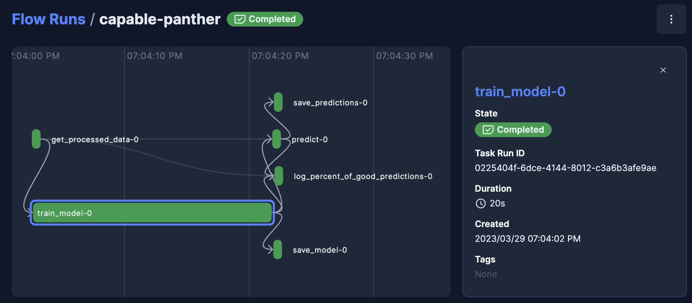
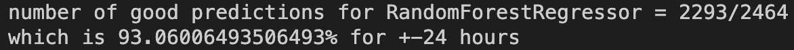
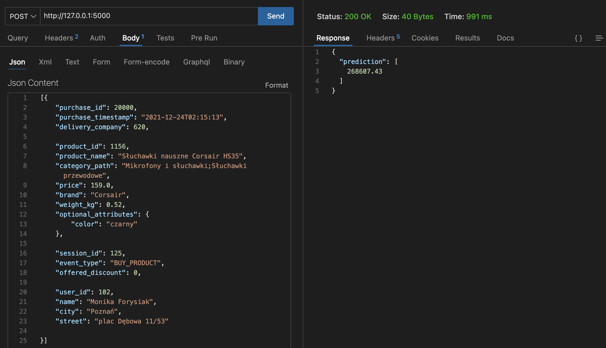

# Delivery time prediction project

## Project description
The goal of the project was to build an ML model that predicts the delivery time of a product purchased at given time.

The project included the following steps:
1. Determining business objectives with the client
2. Data cleaning, EDA, data visualization, feature selection, feature engineering, etc.
3. Preparing model for deployment as a web service

## Technical aspects
- Code is organized in a readable structure
- [Poetry](https://python-poetry.org/) allows for easy and effective management of dependencies
- `Makefile` contains short commands for repeatable tasks
- Only modified components of the pipeline will be rerun
    - e.g. `make pipeline` won't run process data if it's not necessary - it will go straight to training
- Thanks to [pre-commit](https://pre-commit.com/), before every commit the following steps are made automatically:
    1. Code formatting using [black](https://pypi.org/project/black/)
    2. Code quality is being checked with [flake8](https://pypi.org/project/flake8/)
    3. Imports are being sorted with [isort](https://pycqa.github.io/isort/)
    4. [interrogate](https://interrogate.readthedocs.io/en/latest/) checks if there are any missing docstrings (if some must-have conditions are not met, the commit will fail - this forces to write good quality code)
- [pdoc](https://github.com/pdoc3/pdoc) automatically generates documentation
- [Prefect](https://www.prefect.io/) allows you to observe and orchestrate the data processing / training pipeline, for example:

<!-- - Tests are run automatically on commit
- The code includes type hints -->


### Project structure explained
```
.
├── data            
│   ├── final                       # predictions
│   ├── processed                   # data after processing
│   ├── raw                         # raw data
├── docs                            # documentation
├── .flake8                         # configuration for flake8
├── .gitignore                      # define which files should be ignored by git
├── Makefile                        # store useful commands to set up the environment
├── models                          # store models
├── notebooks                       # store notebooks
├── .pre-commit-config.yaml         # configurations for pre-commit
├── pyproject.toml                  # dependencies for poetry
├── README.md                       # project description you are reading right now
├── src                             # store source code
│   ├── __init__.py                 # make src a Python module
│   ├── config.py                   # store configs 
│   ├── process.py                  # process data before training model
│   ├── run_notebook.py             # run notebook
│   └── train_model.py              # train model
└── tests                           # store tests
    ├── __init__.py                 # make tests a Python module 
    ├── test_process.py             # test functions for process.py
    └── test_train_model.py         # test functions for train_model.py
```

## Business problem
*It seems that our courier companies sometimes fail to handle deliveries. If we knew how long such delivery for a given order would take - we could pass this information on to customers.*

So we want to be able to predict the delivery time of a product purchased at a given time.


## Business success criteria
**Expectations:**
*The model will estimate the time of delivery and predict its date and time with an accuracy of +- 24 hours in 90% of cases.*

**Results:**
In the end, the model is correct with an accuracy of +- 24 hours in 93% of cases, so the success criteria was met.


## Selected algorithm
After comparing several regression models, [RandomForestRegressor](https://scikit-learn.org/stable/modules/generated/sklearn.ensemble.RandomForestRegressor.html) was selected. The results given by this model were far better than results given by linear regression models.

## Quick Start
### Set up the environment
1. Install [Poetry](https://python-poetry.org/docs/#installation)
2. Set up the environment:
```bash
make setup
make activate
```

### Install new packages
To install new PyPI packages, run:
```bash
poetry add <package-name>
```

### Run Python scripts
To run the Python scripts to process data and train model, type the following:
```bash
make pipeline
```

### Web service with predictions
The web service is a Flask app that runs on port specified in `src/config.py` file.

To start this web service, type the following:
```bash
make app
```
You don't need to `make pipeline` beforehand. It will be run automatically only when it's needed.

Now in order to make predictions you just need to send a POST request with data as a JSON body, for example:

More example requests are in the `src/example_post_requests` folder.

### View all flow runs with Prefect
A [flow](https://docs.prefect.io/concepts/flows/) is the basis of all Prefect workflows.

To view the flow runs from a UI, sign in to your [Prefect Cloud](https://app.prefect.cloud/) account or spin up a Prefect Orion server on your local machine:
```bash
prefect orion start
```
Open the URL http://127.0.0.1:4200/, and you should see the Prefect UI.

### Auto-generate API documentation

To auto-generate API document, run:

```bash
make docs_save
```

To view the docs, run:
```bash
make docs_view
```

### Cookie Cutter template
The initial project structure has been based on this [Cookiecutter](https://github.com/cookiecutter/cookiecutter) template:
https://github.com/khuyentran1401/data-science-template
